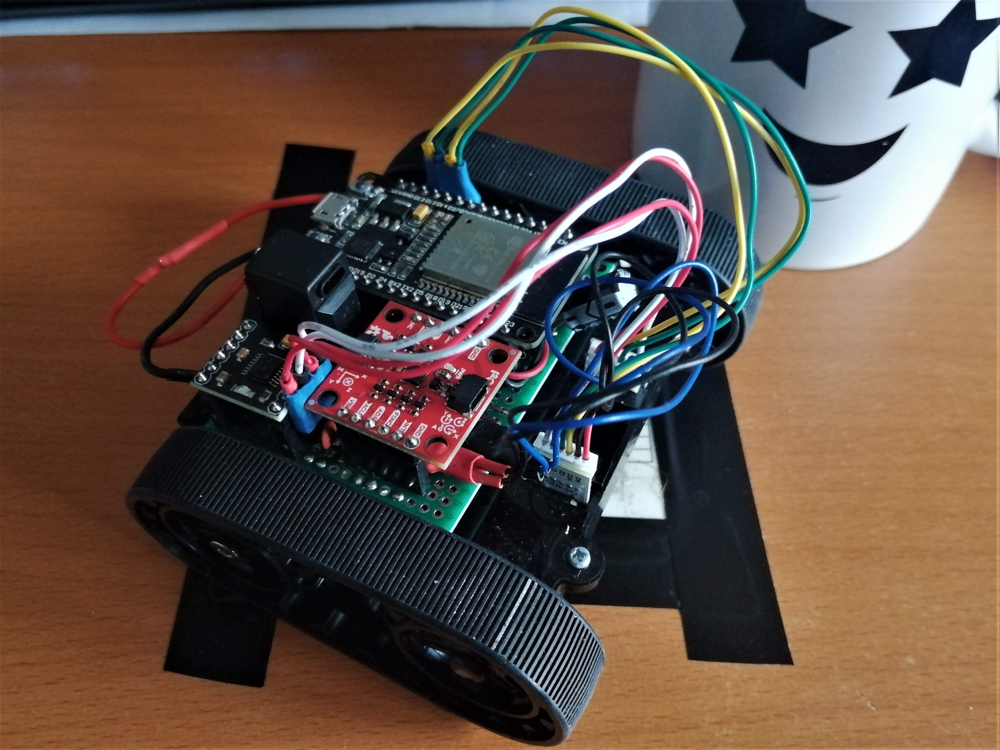

# **DISCLAIMER: W.I.P AND STILL NEEDS A LOT OF WORK BEFORE BEING AT A MINIMUM OPERATING LEVEL** <!-- omit from toc -->

# TeenyBot - *A Small Wireless enable robot to mess around with!!* <!-- omit from toc -->

## Overview

Not to special about the project (for now).
The current aim of the project is to just create a small, simple robot that can be talked to wirelessly and to do whatever I want to do with it.

The whole idea is that I can develop this robot and can add any extra feature that want to experiment with.
Essentially this robot (and this repo itself) serves as a small prototyping platform which I can use to scale to a larger robot platform, if i wanted to .

## Table of Contents <!-- omit from toc -->

- [Overview](#overview)
- [TODO List](#todo-list)
  - [Firmware](#firmware)
  - [Controller](#controller)
  - [Web-Server App](#web-server-app)
  - [Control App](#control-app)
- [Hardware](#hardware)
  - [Robot](#robot)
  - [Controller](#controller-1)
- [Software](#software)
  - [Robot's Microcontroller Firmware](#robots-microcontroller-firmware)
  - [ESP32-based Controller](#esp32-based-controller)
  - [Web-Server App](#web-server-app-1)
  - [Control App](#control-app-1)

## TODO List

### Firmware

- [ ] Communication
  - [ ] Serial CMD (Debug and Dev ONLY)
    - [ ] Send Data
    - [X] Receive Data
  - [ ] Wi-Fi Communication
    - [ ] Local Web-server
    - [X] ESP32-Based Controller (ESPNow)
  - [ ] BT Communication
- [ ] Robot Control
  - [X] Forward and Backwards motor control
    - [X] Half Motor Speed option
      - Currently toggled via a button state on the controller
  - [X] Turning
    - [ ] Blended turning
      - [X] Controller
      - [ ] CMD/Path instructions
    - [ ] Stationary/on-the-spot rotation
- [ ] Auto Stop when lost connection
  - [ ] to controller
  - [ ] to Control server
- [ ] Close-loop speed control
- [ ] Orientation of the robot (**Hardware Dependant**)
  - [ ] ICM-20948 IMU
- [ ] robot position (**Hardware Dependant**)
- [ ] Vision (**Hardware Dependant**)
  - [ ] LIDAR(**Hardware Dependant**)
  - [ ] Video (**MASSIVE Hardware Revision needed**)

### Controller

- [X] Robot Communication
  - [X] Wi-Fi (ESPNow) Connection to robot
    - [X] Send Controller Data to the robot
    - [X] Receive data from the robot
- [X] Robot Control via joystick
  - [X] Drive robot Forward/Backwards
  - [X] Rotate the robot
  - [X] Blended Turning of the robot
    - Happens on the robot's firmware
- [ ] Live Feedback
  - [X] Status Monitor
    - [X] Connection state to Robot
    - [X] Robot Speed
      - [X] Left Motor
      - [X] Right Motor
      - [ ] **(BONUS)** Velocity Vector(?)
    - [ ] Direction (**Hardware Dependant**)
    - [ ] Position (**Hardware Dependant**)

### Web-Server App

Potentially have **two** versions of the (Local Network) Web-Server, one running on an ESP32, another that runs on a standard computer/OS (I am currently thinking of a RPi Zero W currently, but it could change)  

- **TBD**
<!-- - [ ] -->

### Control App

(**Still need to designed on the framework and language**)

- [ ] Robot Communication
  - [ ] Wi-Fi Connection to robot
  - [ ] BT Connection to robot
  - [ ] Send commands
  - [ ] Receive data from the robot
- [ ] Robot Control
  - [ ] Drive robot Forward/Backwards
  - [ ] Rotate the robot
- [ ] Live Feedback
  - [ ] Status Monitor
    - [ ] Robot Speed
    - [ ] Direction (**Hardware Dependant**)
    - [ ] Position (**Hardware Dependant**)
  - [ ] LIDAR(**Hardware Dependant**)
  - [ ] Video (**MASSIVE Hardware Revision needed**)

## Hardware

### Robot

- [Chassis](https://thepihut.com/products/pololu-zumo-chassis-kit-no-motors?variant=42393113428163)
- [Motors](https://thepihut.com/products/micro-metal-geared-motor-w-encoder-6v-105rpm-150-1?variant=27740942929)
- ESP32 Dev board
  - [These are the ones I used (for the Robot)](https://www.amazon.co.uk/dp/B08CCYWZN3/ref=twister_B07Y3VDYSJ?_encoding=UTF8&psc=1)
- [Motor Driver Boards - DRV8833](https://thepihut.com/products/adafruit-drv8833-dc-stepper-motor-driver-breakout-board)
  - [I used these one's](https://www.amazon.co.uk/HALJIA-DRV8833-Channel-Printer-Arduino/dp/B071SJ4T9M/ref=sxts_rp_s_1_0?content-id=amzn1.sym.07198d44-a16f-4503-b71e-3f4c67470a0f%3Aamzn1.sym.07198d44-a16f-4503-b71e-3f4c67470a0f&crid=24HN74SKBRO2I&cv_ct_cx=drv8833&keywords=drv8833&pd_rd_i=B071SJ4T9M&pd_rd_r=eeeaad8c-c59c-40fa-9264-070377be3bc0&pd_rd_w=bDeXo&pd_rd_wg=TLC7a&pf_rd_p=07198d44-a16f-4503-b71e-3f4c67470a0f&pf_rd_r=2JE906Z0MZB1D0X2SRXY&qid=1682629087&sbo=RZvfv%2F%2FHxDF%2BO5021pAnSA%3D%3D&sprefix=drv8833%2Caps%2C90&sr=1-1-1890b328-3a40-4864-baa0-a8eddba1bf6a)
- Power management:
  - Power Switch
    - The one is used was just some random one I had spare
  - Battery: Currently just 4xAA Batteries that the chassis holds
    - Plans to swap this with a rechargeable solution
  - Charger: TBD
  - Voltage Regulator: The once I use are no longer listed but [these ones](https://www.amazon.co.uk/Yizhet-Efficiency-Regulator-Converter-Adjustable/dp/B0823P6PW6/ref=sr_1_2_sspa?keywords=voltage%2Bregulator&qid=1682629281&sprefix=volatage%2Bre%2Caps%2C101&sr=8-2-spons&sp_csd=d2lkZ2V0TmFtZT1zcF9hdGY&th=1) should be fine for now
    - I Plan to change this for smaller (and hopefully better) option when I get to redesigning the rest of the power management of the robot.

### Controller

- ESP32 Dev board
  - [These are the ones I used (for the Controller)](https://www.amazon.co.uk/dp/B071P98VTG/ref=twister_B07ZZFXRTY?_encoding=UTF8&psc=1)
- [Joystick](https://thepihut.com/products/mini-2-axis-analog-thumbstick?variant=27740101329)
- 3 Tactile Switches
- 0.96-inch SSD1306 OLED Display (128x64)
- Power management:
  - Battery: Portable battery bank
    - Plans to swap this with a dedicated, rechargeable solution

## Software

The project has several software tools/programs, Starting from the Microcontroller firmware running on te robot itself, a custom EPS32-based remote control, a web-server application, and a Mobile Controller app.

### Robot's Microcontroller Firmware

The Microcontroller is the main brain of the robot and handles the communication with the Controller/Server/App communication(s) received wirelessly connection.

The code is written using [platformIO](https://platformio.org/) in VSCode use the platformIO [Extention](https://marketplace.visualstudio.com/items?itemName=platformio.platformio-ide) and project files can be found [here](Firmware/)

### ESP32-based Controller

The Controller is based around an ESP32.
This way we can make use of the ESPNow communication protocol to directly connect our controller and robot together and send data back and forth between them.

The Controller IO includes:

- A 2-axis (analog) joystick
- 3 programmable buttons
- 128x64 OLED Display

The programmable button are available to do whatever we want, whether that is a custom menus on the controller and we want to navigate them, or if we want to assign a specific function to them.
Or (as I like to do for most projects) toggle state variable which are transmitted and handled elsewhere.

The OLED screen used is mounted vertically and is used to display the controller and received robot data.
You can either display it as basic text, or (as I prefer) on a simple GUI window.
In the GUI it currently display:

- Joystick analog readings
- Buttons toggle states
- **MOCK/FAKE** IMU data
  - Bearing/Heading angle
  - Accel OR Gryo `X, Y, Z`
- Left and Right Motor Current Speed
- Connection Status to robot

The Controller also implements a **deadzone** _filtering_ effect, as the analog joystick doesn't accurately center itself back between movements and the values jitter around creating noisy readings. The _filter_ used doesn't really classify as a filter (at least to me) and just check if the readings of the joystick axis's are between the center value (`2048`) +/- a `THRESHOLD` values that we can change. If it is, then we just say that the joystick is centred and it reads `2048`, else we send the actual reading form the Joystick.

### Web-Server App

TODO: Write overview and features once development starts

### Control App

TODO: Write overview and features once development starts

#### Libraries/Packages used <!-- omit from toc -->

- **TO ADD LATER**
